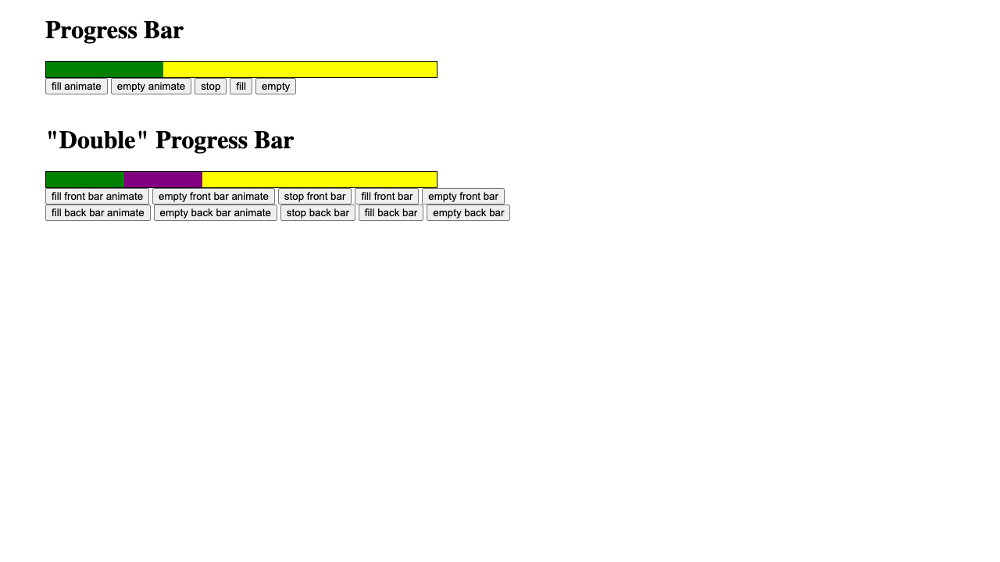

# Javascript Progress Bar

A lightweight, animated progress bar library with support for single and double (layered) progress bars.

**[Demo](https://cogan.github.io/Javascript-Progress-Bar/)**

## Features

- **Progress Bar** — A standard animated progress bar with fill, empty, and stop controls.
- **Double Progress Bar** — Two layered bars (front and back) that fill independently, useful for showing a secondary value like a buffer or comparison.

## API

### ProgressBar

- `setTo(ticks)` — Set the bar to a position instantly
- `fillTo(ticks, fillSpeed, onTick, onFillComplete)` — Animate the bar to a position
- `isFull()` — Check if the bar is full
- `stop()` — Stop the current animation

### DoubleProgressBar

- `setFrontBarTo(ticks)` / `setBackBarTo(ticks)`
- `fillFrontBarTo(ticks, fillSpeed, onTick, onFillComplete)` / `fillBackBarTo(...)`
- `isFrontBarFull()` / `isBackBarFull()`
- `stopFrontBar()` / `stopBackBar()` / `stop()`

## Built With

JavaScript and jQuery.
